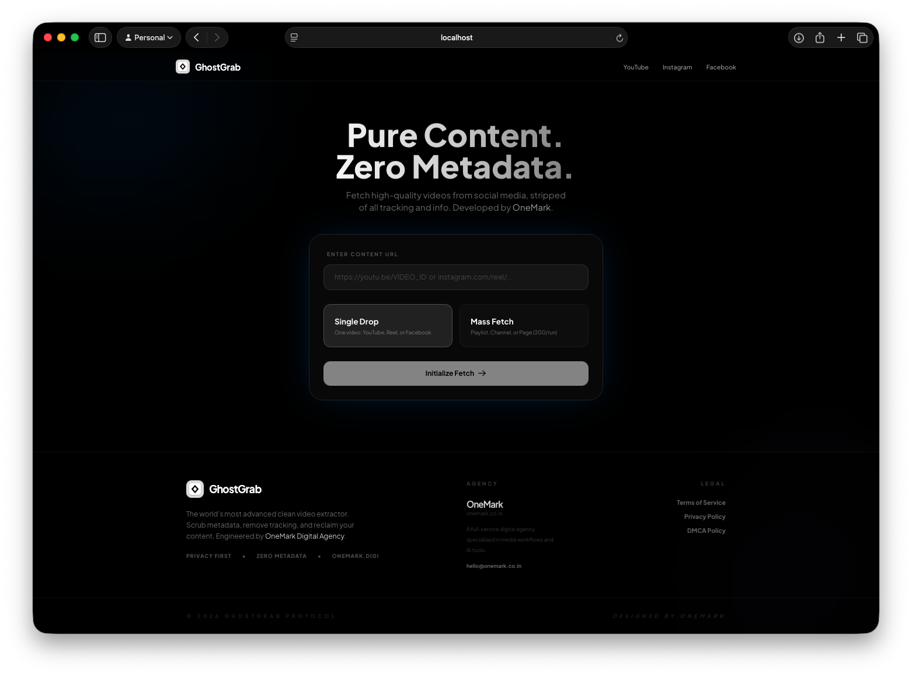
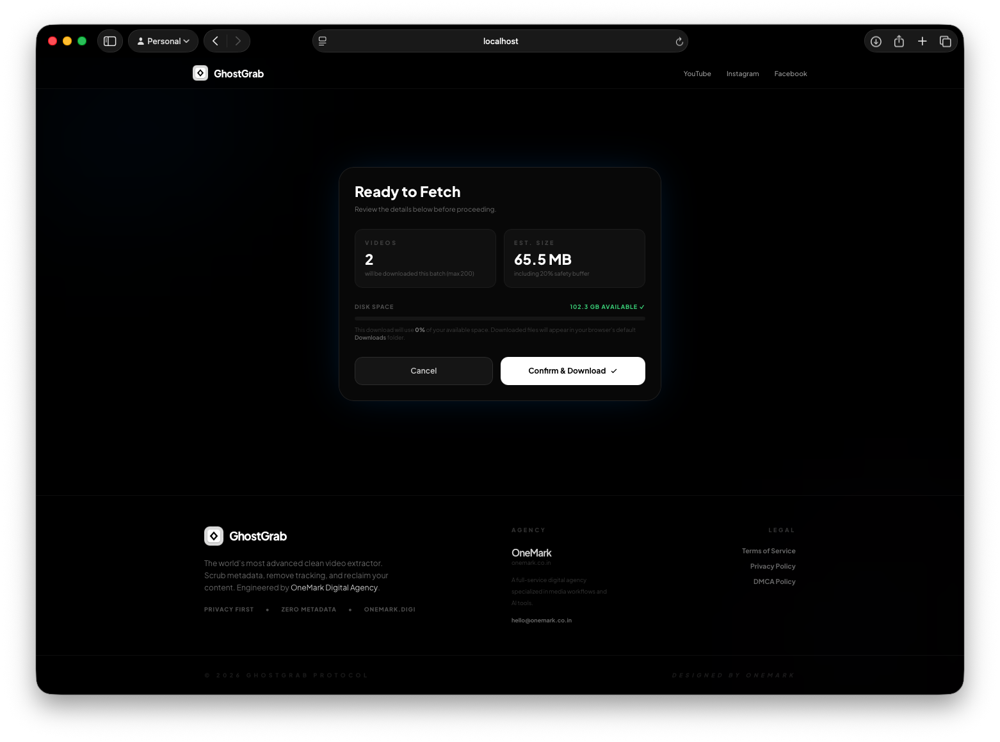
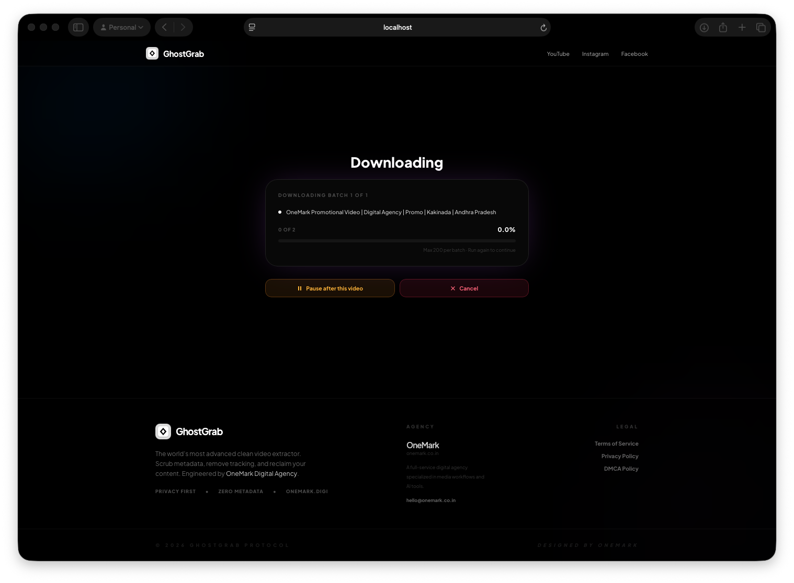
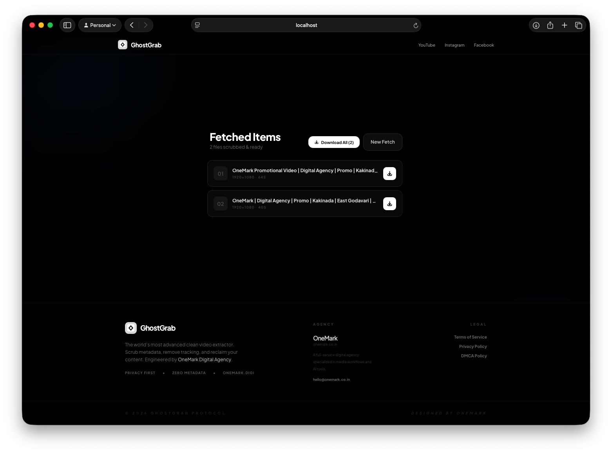

# GhostGrab

> **Pure Content. Zero Metadata.**
> A professional media workflow tool for content agencies — downloads, strips tracking metadata, and re-encodes video for clean YouTube re-upload. Developed by [OneMark](https://onemark.co.in).

### 📸 Interface Preview






---

## What is GhostGrab?

GhostGrab is an **internal professional tool** built by **OneMark Digital Agency** to process video content that the agency owns or has rights to. It automatically strips all tracking metadata and re-encodes video to a cross-platform format ready for YouTube re-upload.

> ⚠️ **GhostGrab is intended for use with content you own or have explicit rights to process.**
> Downloading third-party copyrighted content without permission may violate copyright law and platform Terms of Service.
> See the [Terms of Service](/terms) for full usage guidelines.

### Features

- ✅ Single video download (YouTube, Instagram Reels, Facebook)
- ✅ **Mass Fetch** — YouTube playlists and channels (up to 200/run, resumable)
- ✅ **Download All as ZIP** — batch export when all files are ready
- ✅ Automatic FFmpeg metadata stripping (EXIF, GPS, device fingerprints)
- ✅ **YouTube-ready MP4 output** — H.264 High Profile, yuv420p, AAC 192k, 44.1 kHz
- ✅ **Cross-platform filenames** — ASCII-safe, works on macOS, Windows, and Linux
- ✅ Pre-download disk space check
- ✅ **Real-time progress** — live percentage, speed, and ETA
- ✅ **Cancel or Pause** any in-progress download
- ✅ **Auto-cleanup** — session files permanently deleted after 2h TTL
- ⚠️ Instagram profile/channel batch: currently unavailable (yt-dlp upstream issue)
  - Workaround: use individual reel URLs in Single Drop mode

---

## Prerequisites

Install the following before running GhostGrab:

### 1. Python 3.11+
```bash
# macOS (via Homebrew)
brew install python@3.11

# Verify
python3 --version
```

### 2. Node.js 18+
```bash
# macOS (via Homebrew)
brew install node

# Verify
node --version
```

### 3. FFmpeg
Required for metadata stripping, H.264 re-encoding, and audio normalization.
```bash
# macOS
brew install ffmpeg

# Ubuntu/Debian
sudo apt install ffmpeg

# Windows — download from https://ffmpeg.org/download.html
# Add ffmpeg.exe directory to your PATH environment variable

# Verify
ffmpeg -version
```

### 4. Google Chrome (Recommended)
GhostGrab uses Chrome cookies to authenticate age-restricted and login-required content. Install [Google Chrome](https://www.google.com/chrome/) for best results.

> **Note:** On macOS, Safari's cookie file is protected by system security (Full Disk Access). Chrome is preferred as it's accessible without special permissions.

---

## Installation & Setup

### 1. Clone the repository
```bash
git clone <your-repo-url>
cd video-scrapecrop
```

### 2. Backend Setup

```bash
cd backend

# Create a virtual environment
python3 -m venv .venv
source .venv/bin/activate  # On Windows: .venv\Scripts\activate

# Install dependencies
pip install -r requirements.txt
```

**`requirements.txt` includes:**
- `fastapi` — Web framework
- `uvicorn` — ASGI server
- `yt-dlp` — Video extraction engine
- `pydantic` — Data validation

### 3. Frontend Setup

```bash
cd frontend

# Install Node dependencies
npm install
```

---

## Running GhostGrab

### Quick Start (Both servers at once)

**macOS / Linux:**
```bash
./start.sh
```

**Windows:**
```bat
start.bat
```

### Manual Start

**Terminal 1 — Backend:**
```bash
cd backend
source .venv/bin/activate   # Windows: .venv\Scripts\activate
uvicorn main:app --host 0.0.0.0 --port 8000 --reload
```

**Terminal 2 — Frontend:**
```bash
cd frontend
npm run dev
```

Then open **http://localhost:5173** in your browser.

---

## How to Use

### Single Video Download
1. Select **"Single Drop"**
2. Paste any single video URL (YouTube video, Instagram Reel, Facebook Reel)
3. Click **"Initialize Fetch"**
4. Watch the real-time download percentage and ETA
5. Click download when complete

> ⚠️ Playlist/channel URLs are rejected in Single Drop mode — switch to Mass Fetch instead.

### Mass Fetch (Playlist / Channel / Page)
1. Select **"Mass Fetch"**
2. Paste a playlist, channel, or page URL
3. Click **"Initialize Fetch"**
4. GhostGrab scans the playlist and shows:
   - Total video count
   - Estimated download size
   - Available disk space
   - Disk usage indicator
5. Optionally set a **custom save location** via Browse (native Finder/Explorer dialog)
6. Click **"Confirm & Download"** to begin
7. Watch live progress — each video shows % downloaded, speed, and ETA

> ⚠️ Single video URLs are rejected in Mass Fetch mode — switch to Single Drop instead.

### Cancelling a Download
- Click the **"Cancel"** button (red) at any time during a download
- The current video stops at the next downloaded chunk (within seconds)
- You are returned to the home screen
- Session files are automatically cleaned up

### Pausing a Batch Download
- During a **Mass Fetch** job, click **"Pause after this video"** (amber button)
- GhostGrab finishes the current video cleanly, then stops
- Your progress checkpoint is saved automatically
- You are returned to the home screen
- **To resume:** paste the exact same URL in Mass Fetch and click Initialize Fetch — GhostGrab picks up from where it stopped

### Resuming a Stopped Mass Download
GhostGrab saves a **manifest** for every mass fetch URL. If you stop, pause, or it reaches the 200-video batch limit:
- Simply **paste the same URL again** and click Mass Fetch
- GhostGrab detects the checkpoint and shows **"Resuming from video 201"**
- It skips already-downloaded videos and continues from where it stopped

---

## Architecture

```
video-scrapecrop/
├── backend/
│   ├── main.py                    # FastAPI app, startup cleanup, periodic sweep
│   ├── routers/
│   │   ├── download.py            # POST /api/download, cancel, pause endpoints
│   │   ├── stream.py              # GET /api/stream/{session}/{file}
│   │   ├── jobs.py                # GET /api/job/{job_id} — live progress polling
│   │   ├── preflight.py           # POST /api/preflight — disk space check
│   │   └── folder_picker.py       # POST /api/pick-folder — native OS dialog
│   ├── services/
│   │   ├── downloader.py          # yt-dlp extraction + FFmpeg H.264 encode
│   │   ├── job_manager.py         # Thread-safe job state + cancel/pause signals
│   │   └── manifest.py            # Persistent resume checkpoints (URL-keyed JSON)
│   ├── models/
│   │   └── schemas.py             # Pydantic request/response models
│   ├── utils/
│   │   └── session.py             # Session management, TTL cleanup, yt-dlp cache purge
│   └── sessions/
│       ├── {session-uuid}/        # Temporary video storage per job (auto-deleted)
│       └── .manifests/            # Resume manifests, keyed by URL hash
├── frontend/
│   ├── src/
│   │   ├── App.tsx                # Main UI (IDLE → PREFLIGHT → CONFIRM → DOWNLOADING → RESULTS)
│   │   ├── api/client.ts          # API layer (preflight, startDownload, getJobStatus)
│   │   ├── index.css              # Design system
│   │   └── pages/
│   │       ├── Privacy.tsx        # Privacy Policy page
│   │       ├── Terms.tsx          # Terms of Service page
│   │       └── DMCA.tsx           # DMCA Policy page
│   ├── public/
│   │   ├── logo.png               # GhostGrab logo
│   │   └── favicon.png
│   └── index.html
├── start.sh                       # macOS/Linux quick-start script
├── start.bat                      # Windows quick-start script
├── README.md                      # This file
└── CLOUD_HOSTING.md               # Infrastructure & deployment guide
```

---

## API Reference

| Method | Endpoint | Description |
|--------|----------|-------------|
| `POST` | `/api/preflight` | Scan playlist, estimate size, check disk space |
| `POST` | `/api/download` | Start background download job, returns `job_id` |
| `GET`  | `/api/job/{job_id}` | Poll for live progress (status, %, speed, ETA) |
| `POST` | `/api/job/{job_id}/cancel` | Immediately cancel a running job |
| `POST` | `/api/job/{job_id}/pause` | Pause batch after current video (manifest saved) |
| `GET`  | `/api/stream/{session}/{file}` | Stream a processed video |
| `GET`  | `/api/download-file/{session}/{file}` | Download a processed video |
| `POST` | `/api/pick-folder` | Open native OS folder picker dialog |
| `DELETE` | `/api/session/{session_id}` | Immediately delete session files and purge cache |
| `GET`  | `/api/health` | Health check |

---

## Configuration

| Setting | Location | Default | Description |
|---------|----------|---------|-------------|
| `MAX_BATCH` | `services/downloader.py` | `200` | Max videos per mass fetch run |
| `SESSION_TTL_HOURS` | `utils/session.py` | `2` | Auto-cleanup of session files (in hours) |
| Audio bitrate | `services/downloader.py` | `192k` | AAC audio quality |
| Video codec | `services/downloader.py` | `H.264 High, CRF 20` | YouTube-ready encoding preset |
| Pixel format | `services/downloader.py` | `yuv420p` | Required for Windows Media Player compat |

---

## Output Video Format

All videos are re-encoded to be **YouTube-upload ready** and **cross-platform compatible**:

| Property | Value | Why |
|---|---|---|
| Container | MP4 | Universal support |
| Video codec | H.264 (High Profile, Level 4.0) | Plays on iOS, Android, Windows, macOS, YouTube |
| Pixel format | yuv420p | Required for Windows Media Player |
| Quality | CRF 20 | High quality, smaller than CRF 18 |
| Audio codec | AAC-LC | Standard for MP4, universal support |
| Audio bitrate | 192k | High quality |
| Audio sample rate | 44100 Hz | YouTube's preferred rate |
| Web optimization | `+faststart` | Moov atom at front for instant playback |

---

## Output File Naming

All processed files follow this naming convention:
```
GhostGrab_{SafeTitle}_{UniqueID}.mp4
```

- **SafeTitle**: First 40 ASCII alphanumeric characters of the video title
- **For non-English titles** (Hindi, Arabic, CJK, etc.): falls back to the video ID — always safe on every filesystem
- **UniqueID**: 8-character UUID fragment to prevent collisions

Examples:
```
GhostGrab_How_to_make_pasta_a1b2c3d4.mp4       ← English title
GhostGrab_DdQKh7fA_9b4e2c1a.mp4                ← Non-ASCII title (video ID used)
```

---

## Cache & Disk Management

GhostGrab is designed to leave zero residual data:

| Trigger | What is cleaned |
|---|---|
| Server startup | Sessions older than 2h + yt-dlp metadata cache |
| Every 30 minutes | Automatic sweep of expired sessions |
| User clicks "Start Over" | That session deleted immediately |
| User clicks "Cancel" | Session deleted + yt-dlp cache purged |

**yt-dlp cache locations purged automatically:**
- `~/.cache/yt-dlp/` (Linux/macOS)
- `~/Library/Caches/yt-dlp/` (macOS)
- `%APPDATA%\yt-dlp\` (Windows)

---

## Troubleshooting

### "Operation not permitted" — Safari Cookies
macOS blocks third-party access to Safari's cookie file. **Fix:** Install Google Chrome. GhostGrab automatically prefers Chrome on macOS.

### "Not enough disk space" error
The preflight check failed. Free up space or choose a different save path. GhostGrab adds a 20% safety buffer to estimates.

### Videos download but won't play on Windows
Ensure FFmpeg is installed and in PATH (`ffmpeg -version`). Older downloads may use a non-yuv420p pixel format — re-download to get the Windows-compatible version.

### Download fails for age-restricted content
Log into YouTube or Instagram in **Google Chrome** and allow GhostGrab to access Chrome cookies when prompted by the macOS keychain dialog (click "Always Allow").

### Preflight scan is slow for large channels
Flat-extraction scans without downloading, but large channels (1000+ videos) may still take 15–30 seconds to fully enumerate.

### Cancel button doesn't stop immediately
yt-dlp processes chunks in ~1–2 MB pieces. The cancel signal is checked at every chunk boundary, so stopping takes 1–5 seconds on fast connections.

### Batch paused — how do I resume?
Paste the exact same URL in Mass Fetch mode and click Initialize Fetch. GhostGrab reads the checkpoint manifest and resumes from the next pending video automatically.

---

## Cloud Hosting

See **[CLOUD_HOSTING.md](./CLOUD_HOSTING.md)** for:
- Exact hardware requirements (CPU, RAM, disk, network)
- Provider comparison (Hetzner, Railway, DigitalOcean, Fly.io, Render, AWS)
- Why Vercel cannot host GhostGrab
- Complete Docker + nginx deployment guide
- Security hardening (rate limiting, CORS, firewall, SSL)
- Cost breakdown and scaling guide

---

## Legal & Compliance

- **Terms of Service**: `/terms`
- **Privacy Policy**: `/privacy`
- **DMCA Policy**: `/dmca`

### ⚠️ Important Legal Notice

GhostGrab is a **professional media processing tool** intended for use by content agencies and creators
who are working with video content they own or have rights to.

**This tool must NOT be used to:**
- Download copyrighted content from YouTube, Instagram, Facebook, or any platform without the permission of the copyright holder.
- Circumvent subscription systems, paywalls, or platform download restrictions.
- Redistribute or resell third-party copyrighted content.

**Users are solely responsible for ensuring their use complies with:**
- The Terms of Service of any platform they interact with.
- The Copyright Act 1957 (India) and applicable international copyright law.
- The Digital Millennium Copyright Act (DMCA) where applicable.

OneMark accepts no liability for misuse of this tool. See [`/terms`](/terms) for full Terms of Service.

---

Developed by **OneMark Digital Agency** · hello@onemark.co.in · [onemark.co.in](https://onemark.co.in)
